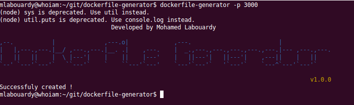
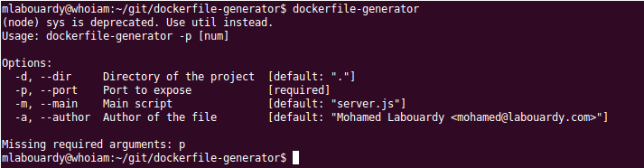

## Dockerfile Generator

Generate Dockerfile to build Docker image for a NodeJS project.

## How To

Install module globally

```sh
npm install -g dockerfile-generator
```

Run module

```sh
dockerfile-generator --port 3000
```

## Example:



# Config



## Creators

Mohamed Labouardy, http://www.labouardy.com


## Contributors

Feel free to contribute
